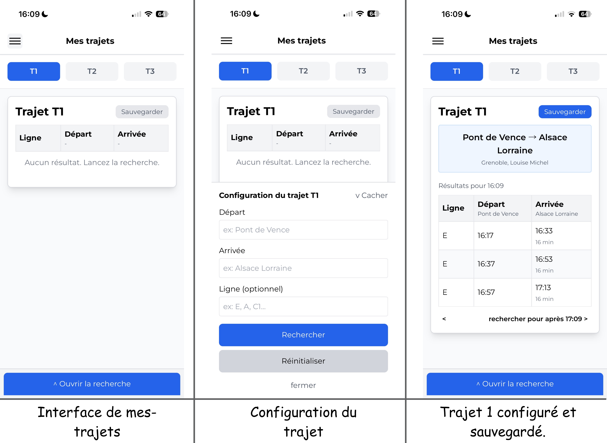

[](https://gre-go.vercel.app/)

[](https://web-tag-express.vercel.app/)
[](https://reactjs.org/)
[](https://vitejs.dev/)
[](https://tailwindcss.com/)

**Release 2.0 déployée !**

> Une application web moderne faite pour Mobile seulement à l'heure actuelle pour gérer et rechercher des trajets de transport utilisant le système de transit TAG (Transports de l'Agglomération Grenobloise).
> Cette app est toujours en développement, certains bugs peuvent donc apparaître. Merci de les report dans ```issues``` lorsque cela arrive.

> ⚠️ : les itinéraires peuvent être imprécis en fonction de la ligne. (ex: une ligne de tram aura des itinéraires plus précis qu'une ligne de bus). Cela est dû au traffic et aux imprévus de la route, qui peuvent donc décaler les horaires théoriques.

## Captures d'écran de /mes-trajets/



## Fonctionnalités

- **Gestion Multi-Trajets** : Enregistrez et gérez jusqu'à 3 trajets différents avec sauvegarde automatique et persistante
- **Recherche de Trajets** : Recherchez des trajets de transport avec filtres par départ, arrivée et numéro de ligne
- **Stockage Persistant** : Tous les trajets sont automatiquement sauvegardés dans le localStorage du navigateur
- **Navigation Temporelle** : Naviguez entre différents créneaux horaires pour le même trajet
- **Données en Temps Réel** : Intégration avec l'API TAG pour des informations actualisées
- **Recherche Rapide** : Fonctionnalité de recherche rapide pour des requêtes ponctuelles
- **Editer nom trajets** : Vous pouvez éditer le noms de vos trajets.
- **Support des correspondances** : Correspondances supportées.
- **Onglet détails** : Ouverture fenêtre quand clic sur une bulle qui indique les détails de votre trajet.
- **Exporter/importer json** : Vous pouvez exporter votre fichier de configuration des trajets, afin de retrouver vos trajets d'un appareil à l'autre
- **Onglet settings** : Vous pouvez changer les paramètres de l'API tel que la vitesse de marche, l'accessibilité PMR, et plus.
- **Système de cache** : Cache de 1 minute afin d'appeller moins régulièrement l'API.
- **Refresh** : A l'aide d'un seul clic, vous pouvez rafraichir manuellement vos trajets.
- **Icones** : icones générées par le fichier lines-icons.jsx afin de ne pas utiliser des images sous copyright de la MTAG.

## Stack Technologique (pour devs)

- **Frontend** : React 18
- **Outil de Build** : Vite
- **Styling** : Tailwind CSS
- **Routage** : React Router v6
- **Client HTTP** : Fetch API
- **Source Données** : API TAG Mobilités (data.mobilites-m.fr)

## Démarrage

### Prérequis

- Node.js (v14 ou supérieur)
- npm

### Installation

1. Clonez le repository :
```bash
git clone https://github.com/Palmine38/GreGo.git
cd GreGo
```

2. Installez les dépendances :
```bash
npm install
```

3. Lancez le serveur de développement :
```bash
npm run dev
```

4. Buildez pour la production :
```bash
npm run build
```

## Structure du Projet

```
src/
├── components/
│   ├── mestrajets-test.jsx         # Composant principal de gestion des trajets
│   ├── fast-research.jsx           # Page de recherche rapide
│   ├── navbar.jsx                  # Barre de navigation
│   ├── mestrajets.jsx              # Fichier obsolete pour la gestion des trajets.
│   ├── settings.jsx                # Settings
│   ├── lines-icons.jsx             # Génération des icones de ligne.
│
├── App.jsx                         # Composant principal
├── App.css                         # Styles globaux
└── main.jsx                        # Point d'entrée

public/
├── logos/                          # Dossier qui contient les logos de GreGo
│
└── Fichiers image                  # Favicons, apple-touch icons...
```

## Composants Principaux

### Mes Trajets     (fichier *mestrajets-test.jsx*)
- Gérez jusqu'à 3 trajets sauvegardés
- Visualisez et modifiez les détails des trajets (départ, arrivée, ligne)
- Sauvegarde automatique avec retour visuel
- Persistance des données entre les sessions

### Recherche Rapide     (fichier *fast-research.jsx*)
- Recherche ponctuelle sans sauvegarde
- Mêmes capacités de recherche que les trajets sauvegardés
- Affichage rapide des résultats

### Barre de Navigation     (fichier *navbar.jsx*)
- Navigation entre les pages
- Menu hamburger pour mobile
- Design responsive

### Settings     (fichier *settings.jsx*)
- Accessibilité PMR
- Vitesse de marche
- Nombre de trajets retournés

### Lines Icons     (fichier *lines-icons.jsx*)
- Récupère couleur de lignes et génère icones.

## Intégration API

L'application utilise l'API ouverte TAG Mobilités :
- **URL de Base** : `https://data.mobilites-m.fr/api/routers/default`
- Récupère les trajets disponibles, arrêts et itinéraires
- Données de transport en temps réel

## Fonctionnalités en Détail

### Sauvegarde de Trajets
- Enregistrez les préférences de départ, arrivée et ligne
- Restauration automatique au rechargement de la page
- Boutons avec codes couleur pour trajets sauvegardés/non-sauvegardés

### Filtrage de Recherche
- Filtrez par ligne spécifique *(falcutatif)*

### Gestion d'État
- Hooks React pour la gestion d'état
- localStorage pour la persistance
- Cache séparé pour les résultats de recherche par trajet

## Compatibilité Navigateurs

- Chrome/Chromium (dernière version)
- Firefox (dernière version)
- Safari (dernière version)
- Edge (dernière version)

## Licence

Ce projet est open source et disponible sous la licence MIT.

## Crédits

Ce projet ne serait pas possible sans les APIs opendata fournies par MRESO.

## Auteur

Créé par [Palmine38](https://github.com/Palmine38) avec la collaboration de [Antquu](https://github.com/antquu)

## Contribution

Les contributions sont les bienvenues ! N'hésitez pas à soumettre des pull requests ou ouvrir des issues pour les bugs et demandes de fonctionnalités.
