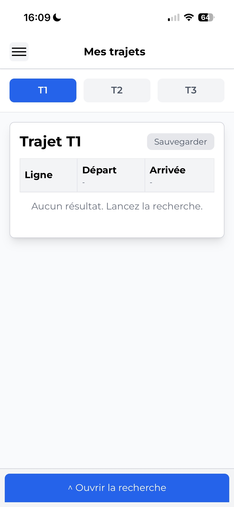
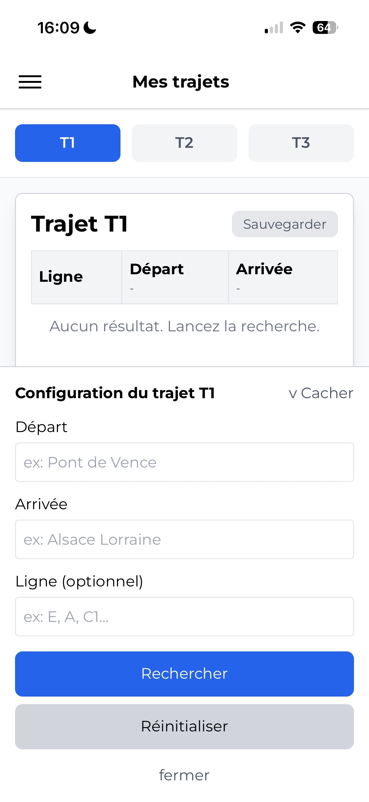
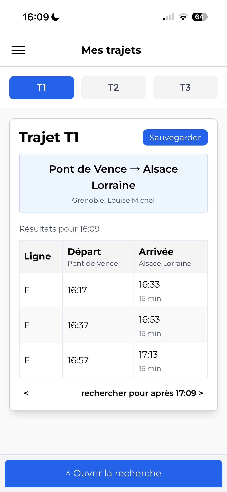

[](https://reactjs.org/)
[](https://vitejs.dev/)
[](https://tailwindcss.com/)

# TAG Express - Application Web

> Une application web moderne MOBILE ONLY (pour l'instant) pour gérer et rechercher des trajets de transport utilisant le système de transit
> TAG (Transports de l'Agglomération Grenobloise).

## Captures d'écran de /mes-trajets/


*Interface des trajets.*

### Sidebar des détails

*Configuration du trajet.*

### Vue mobile

*Trajet 1 configuré et sauvegardé.*

## Fonctionnalités

- **Gestion Multi-Trajets** : Enregistrez et gérez jusqu'à 3 trajets différents (T1, T2, T3) avec sauvegarde persistante
- **Recherche de Trajets** : Recherchez des trajets de transport avec filtres par départ, arrivée et numéro de ligne
- **Stockage Persistant** : Tous les trajets sont automatiquement sauvegardés dans le localStorage du navigateur
- **Navigation Temporelle** : Naviguez entre différents créneaux horaires pour le même trajet
- **Design Responsive** : Fonctionne parfaitement sur les appareils mobiles et de bureau
- **Données en Temps Réel** : Intégration avec l'API TAG pour des informations actualisées
- **Recherche Rapide** : Fonctionnalité de recherche rapide pour des requêtes ponctuelles

## Stack Technologique

- **Frontend** : React 18
- **Outil de Build** : Vite
- **Styling** : Tailwind CSS
- **Routage** : React Router v6
- **Client HTTP** : Fetch API
- **Source Données** : API TAG Mobilités (data.mobilites-m.fr)

## Démarrage

### Prérequis

- Node.js (v14 ou supérieur)
- npm ou yarn

### Installation

1. Clonez le repository :
```bash
git clone https://github.com/Palmine38/Web-TAG-express.git
cd Web-TAG-express
```

2. Installez les dépendances :
```bash
npm install
```

3. Lancez le serveur de développement :
```bash
npm run dev
```

4. Buildez pour la production :
```bash
npm run build
```

## Structure du Projet

```
src/
├── components/
│   ├── mestrajets.jsx      # Composant principal de gestion des trajets
│   ├── testhome.jsx        # Page de recherche rapide
│   └── navbar.jsx          # Barre de navigation
├── App.jsx                 # Composant principal
├── App.css                 # Styles globaux
└── main.jsx               # Point d'entrée
```

## Composants Principaux

### Mes Trajets
- Gérez jusqu'à 3 trajets sauvegardés
- Visualisez et modifiez les détails des trajets (départ, arrivée, ligne)
- Sauvegarde automatique avec retour visuel
- Persistance des données entre les sessions

### Recherche Rapide
- Recherche ponctuelle sans sauvegarde
- Mêmes capacités de recherche que les trajets sauvegardés
- Affichage rapide des résultats

### Barre de Navigation
- Navigation entre les pages
- Menu hamburger pour mobile
- Design responsive

## Intégration API

L'application utilise l'API ouverte TAG Mobilités :
- **URL de Base** : `https://data.mobilites-m.fr/api/routers/default`
- Récupère les trajets disponibles, arrêts et itinéraires
- Données de transport en temps réel

## Fonctionnalités en Détail

### Sauvegarde de Trajets
- Enregistrez les préférences de départ, arrivée et ligne
- Restauration automatique au rechargement de la page
- Boutons avec codes couleur pour trajets sauvegardés/non-sauvegardés

### Filtrage de Recherche
- Filtrez par numéro de ligne spécifique
- Supporte plusieurs formats de ligne (E, A, C1, etc.)
- Résultats limités aux trajets de moins de 35 minutes
- Navigation temporelle pour différents créneaux horaires

### Gestion d'État
- Hooks React pour la gestion d'état
- localStorage pour la persistance
- Cache séparé pour les résultats de recherche par trajet

## Compatibilité Navigateurs

- Chrome/Chromium (dernière version)
- Firefox (dernière version)
- Safari (dernière version)
- Edge (dernière version)

## Licence

Ce projet est open source et disponible sous la licence MIT.

## Auteur

Créé par [Palmine38](https://github.com/Palmine38)

## Contribution

Les contributions sont les bienvenues ! N'hésitez pas à soumettre des pull requests ou ouvrir des issues pour les bugs et demandes de fonctionnalités.